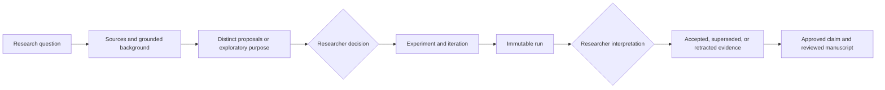

<p align="center">
  
</p>

<p align="center">
  <a href="https://github.com/sarodarte2/smairt-toolkit/actions/workflows/ci.yml"></a>
  <a href="https://github.com/sarodarte2/smairt-toolkit/actions/workflows/security.yml"></a>
</p>

# SMAIRT

**A scientific method framework that helps researchers use AI while preserving evidence,
provenance, and human judgment.**

> [!IMPORTANT]
> SMAIRT is a research preview. The core workflows are implemented and tested, but interfaces may
> change before a stable release. The included enzyme-kinetics example has not completed its
> human walkthrough and must not be cited as validation of the software or a scientific result.

SMAIRT (Scientific Method with AI Research Toolkit) is a local-first Python application for
organizing AI-assisted research as a reviewable scientific process. It connects questions,
references, hypotheses or exploratory purposes, experiments, immutable runs, decisions, evidence,
and manuscript claims without treating an agent conversation as the scientific record.

## Why SMAIRT Exists

AI assistants can search literature, draft code, compare explanations, and prepare analyses. They
can also make it easy to lose the boundary between a suggestion and a scientific decision. SMAIRT
keeps that boundary visible:

- researchers select hypotheses, approve experimental routes, interpret evidence, and authorize
  claims;
- AI assistants work from bounded context and produce inspectable proposals or artifacts;
- durable YAML, JSON, and Markdown records preserve provenance outside chat history;
- validation, locks, transactions, and immutable run manifests protect the record from accidental
  rewriting.

## How the Research Lifecycle Fits Together



The software can help prepare every stage, but the two decision points remain human gates.

| SMAIRT and an AI Assistant can | The Researcher MUST |
| --- | --- |
| Organize references and attributed metadata | Decide which sources are relevant and trustworthy |
| Draft background and compare proposals | Frame the question and select or revise scientific direction |
| Create experiment scaffolds and analysis code | Approve methods, controls, criteria, and consequential changes |
| Capture runs, logs, environments, and checksums | Interpret results and decide whether evidence is acceptable |
| Assemble claims and manuscript sections | Approve claims, corrections, and publication-ready text |

## Install and Orient Yourself

SMAIRT does not yet publish a verified package release. After installing Git and
[uv](https://docs.astral.sh/uv/), install the source preview without cloning or managing Python:

```bash
uv tool install --python 3.11 git+https://github.com/sarodarte2/smairt-toolkit.git
smairt
```

Bare `smairt` is the context-aware Home. It can run optional first-time setup, create a project, or
reopen a recent project without requiring directory commands. Setup belongs to this machine, not a
research project, and Conda is not required.

Create or resume a project from Home:

```bash
smairt
```

The wizard derives the folder from the project name, prefills only values explicitly saved in the
local starter profile, and requires project-specific policy choices. The dashboard shows the
current research stage and one bounded handoff without crossing a scientific decision gate.

See [Installation](docs/getting-started/installation.md) for prerequisites and optional
connections, then follow the [Quickstart](docs/getting-started/quickstart.md) for a careful tour of
a new project.

## What SMAIRT Records

A generated project is a readable directory rather than an opaque application database:

```text
my-study/
├── smairt.yaml          project identity, policy, people, environment, and active harness
├── background/          question, description, and source-grounded synthesis
├── hypotheses/          proposal sets and the researcher-selected direction
├── experiments/         protocols, iterations, analysis code, and method changes
├── results/             immutable run bundles, logs, snapshots, and integrity manifests
├── analysis/            interpretations linked to specific experiments and runs
├── references/          attributed metadata and optional local PDF checksums
├── paper/               evidence cards, claims, reviews, figures, and versioned builds
├── summaries/           contributor-scoped and promoted context summaries
└── .smairt/             local bindings, locks, transactions, recovery state, and manifests
```

Git remains the collaboration and history layer. SMAIRT adds scientific state transitions,
provenance, and validation; it does not replace peer review or laboratory judgment.

## Current capability areas

### Research records and provenance

- Source-grounded background, three-option proposal sets, selected hypotheses, and explicitly
  exploratory experiments.
- Versioned experiment protocols, new iterations for meaningful method changes, and immutable local
  or optional Slurm run records.
- Human decisions, evidence cards, claims, manuscript reviews, corrections, retractions, and
  supersessions that preserve history.

### Literature and Context

- Local PDF indexing, DOI metadata through Crossref with a narrow DataCite fallback, and optional
  Zotero import.
- Optional OpenAlex and Semantic Scholar discovery plus explicit Unpaywall access resolution.
- Bounded context packets, state-aware next steps, and copyable prompts for supported coding
  harnesses.

### Integrity and Collaboration

- Typed records, atomic writes, mutation locks, recoverable transactions, checksums, and run
  manifests.
- One active adapter for Codex, Zoo Code, Cline, OpenCode, Cursor, or Claude Code while scientific
  records remain portable.
- A metadata-only MCP server that does not expose PDF contents, arbitrary filesystem paths, or
  mutation tools.

## Safety Boundary

SMAIRT is not a sandbox and does not certify regulatory, institutional, contractual,
export-control, clinical, or human-subject compliance. It runs with the researcher's filesystem
permissions. Its checks reduce accidental policy violations within a documented local scope;
they do not make controlled-data work compliant or defend against a malicious local user with the
same access.

Normal status, validation, doctor, and project-menu refreshes are offline. Remote metadata access,
PDF downloads, repository-visibility refreshes, HPC submission, and project mutations require
explicit actions. Read the full [Safety model](docs/concepts/safety.md) before private work.

## Limitations of this Preview

- There is no tagged release or PyPI distribution; installation is from source.
- Project and user-local schemas may change during the preview period.
- Native Windows is not supported; use WSL. Local execution is the default, with Slurm support as
  an optional transport rather than a general scheduler abstraction.
- Harness hooks and permissions are defense in depth and depend on each client. SMAIRT's own CLI,
  integrity checks, and human gates remain authoritative.
- The enzyme-kinetics walkthrough is retained as unverified preview material and is not an
  acceptance criterion or scientific validation claim.

## Documentation

Start at the [documentation hub](docs/README.md), or choose the route that matches your goal:

- New researcher: [Installation](docs/getting-started/installation.md) →
  [Quickstart](docs/getting-started/quickstart.md) →
  [Research Workflow](docs/guides/research-workflow.md)
- Scientific and safety review: [Scientific Workflow](docs/concepts/scientific-workflow.md) →
  [Safety Model](docs/concepts/safety.md) → [Architecture](docs/concepts/architecture.md)
- Harness selection: [Harness Guide](docs/reference/harnesses.md)
- Command lookup: [CLI Reference](docs/reference/cli.md)
- Development: [Contributing](CONTRIBUTING.md) →
  [Developer Guide](docs/development/developer-guide.md)

## Origins, Support, and License

This repository is an independent fork of
[PNNL-CompBio/smairt-template](https://github.com/PNNL-CompBio/smairt-template). The original
framework was created by the PNNL Computational Biology Group and its contributors. See
[Acknowledgments](ACKNOWLEDGMENTS.md) for the provenance and non-endorsement statement.

Use [GitHub Issues](https://github.com/sarodarte2/smairt-toolkit/issues) for questions, defects, and
feature proposals. Report vulnerabilities privately as described in [Security](SECURITY.md).
SMAIRT is distributed under the unchanged [MIT License](LICENSE).
