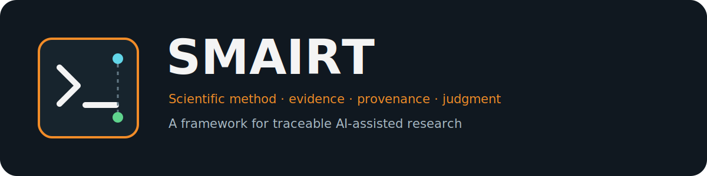
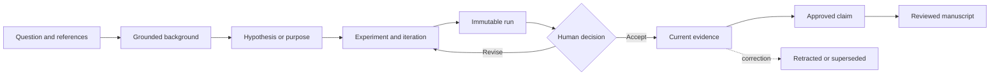

<p align="center">
  
</p>

<p align="center">
  <a href="https://github.com/PNNL-CompBio/smairt-template/actions/workflows/ci.yml"></a>
  <a href="https://github.com/PNNL-CompBio/smairt-template/releases"></a>
  
  
  <a href="LICENSE"></a>
  <a href="CITATION.cff"></a>
</p>

SMAIRT is a local-first research workflow for scientists working with coding agents. It preserves
the chain from a research question through references, hypotheses or exploratory purposes,
immutable experiment runs, human decisions, accepted evidence, approved claims, and a reviewable
manuscript. Scientific state stays in portable YAML, JSON, and Markdown rather than inside one AI
vendor.

> **Beta safety notice:** SMAIRT safety checks are experimental. They are useful technical
> guardrails, not regulatory, institutional, contractual, export-control, or human-subject
> compliance certification. Controlled data is unsupported for compliance in this beta.

## Choose your path

| I am a researcher | I maintain or extend SMAIRT |
|---|---|
| Start with the five-minute workflow below, then read the [User Guide](docs/USER_GUIDE.md). | Read the [Developer Guide](docs/DEVELOPER_GUIDE.md) and [Architecture](docs/ARCHITECTURE.md). |
| Use `smairt new` for the guided terminal wizard and `smairt menu` for the next-action dashboard. | Use the source-scoped test, type, security, package, and release gates documented in the [Release Guide](docs/RELEASE.md). |
| Learn collaboration and corrections in the [Tutorial](TUTORIAL.md). | See the [CLI contract](docs/CLI_REFERENCE.md), [Security Policy](SECURITY.md), and [Contributing Guide](.github/CONTRIBUTING.md). |

## Five-minute workflow

Install the wheel from the `0.2.0-beta.1` GitHub Release (or use the source setup in the Developer
Guide), then create a project:

```bash
python -m pip install "smairt @ https://github.com/PNNL-CompBio/smairt-template/releases/download/v0.2.0-beta.1/smairt-0.2.0b1-py3-none-any.whl"
smairt new my-study \
  --name "My Study" \
  --author "Researcher Name" \
  --confirm-contributor \
  --classification unpublished \
  --harness codex
cd my-study
smairt status --json
smairt next --json
smairt menu
```

Run `smairt new` without `--name` and `--author` for the responsive terminal wizard. Ordinary
status, validation, doctor, and TUI refresh operations stay offline.



The [Quickstart](QUICKSTART.md) executes the complete placeholder-to-evidence journey. The
[Tutorial](TUTORIAL.md) adds collaboration, correction, claim review, and Markdown/DOCX builds.

## Harnesses: truthful enforcement

SMAIRT supports one active harness per project. CLI validation, Git checks, immutable records, and
human gates remain authoritative; instructions alone are never described as enforcement.

| Harness | Rules | Protected-operation hook | Context restore | Notes |
|---|---|---|---|---|
| Codex | Advisory | Advisory | Manual | Project `hooks.json` is validation support, not a guaranteed blocker. |
| Zoo Code | Advisory | Unsupported | Manual | Zoo deliberately retains Roo-compatible `.roo`, `.roomodes`, and `.rooignore` paths. |
| Cline | Advisory | Blocking when hooks are enabled | Advisory | `PreToolUse` blocks; `TaskStart` and `TaskResume` inject current status and next action. |

Preview every switch with `smairt harness select zoo --dry-run`. SMAIRT owns individual files by
hash manifest, preserves custom files, and stops on conflicts or modified managed files. See
[Harness Adapters](docs/HARNESSES.md).

## Individual and collaborative work

An individual uses the same explicit gates as a team: register a contributor, select a hypothesis
or purpose, run through `smairt run`, record a decision, and approve claims before drafting.

Teams use separate Git branches or worktrees for parallel work. A checkout-local mutation lock
prevents simultaneous writers from corrupting shared state; transaction journals make multi-file
changes recoverable. SMAIRT does not automatically merge scientific judgments.

```bash
smairt lock status --json
smairt recovery status --json
smairt doctor --json
```

## Safety modes

Classification describes the material; mode describes SMAIRT's response. Both modes block common
credentials, private keys, protected paths, and raw-data formats from Git.

- **Standard** supports ordinary public or private research collaboration. Unknown visibility is
  usually a warning, while protected release operations still require adequate evidence.
- **Strict** fails closed for consequential sharing and release, requires a fresh observed private
  GitHub visibility, and keeps protected summaries local unless shareability and redaction are
  explicitly confirmed.

Visibility lookup is explicit and cached:

```bash
smairt safety status --refresh-visibility --json
smairt safety release-check --json
```

Read the complete [experimental safety contract](docs/SAFETY.md) before using protected material.

## Documentation and support

- [User Guide](docs/USER_GUIDE.md) · [CLI Reference](docs/CLI_REFERENCE.md) ·
  [Troubleshooting](docs/TROUBLESHOOTING.md)
- [Developer Guide](docs/DEVELOPER_GUIDE.md) · [Architecture](docs/ARCHITECTURE.md) ·
  [Release Guide](docs/RELEASE.md)
- [Security](SECURITY.md) · [Support](SUPPORT.md) · [Changelog](CHANGELOG.md) ·
  [Contributing](.github/CONTRIBUTING.md)

SMAIRT supports Linux and macOS natively and Windows through WSL. Native Windows and PyPI
publication are outside this beta milestone. The project uses the MIT License; cite releases with
[CITATION.cff](CITATION.cff).
