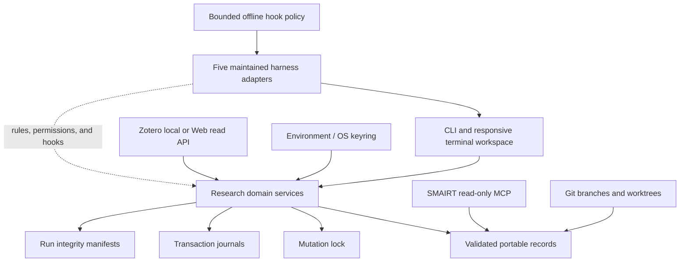

# SMAIRT Architecture

## Boundaries

The CLI and TUI are presentation layers over the same Python domain modules. Neither harness
adapters nor agent conversations own scientific state.

## State and concurrency

`.smairt/locks/mutation.lock` is created atomically and records host, PID, command, contributor,
and acquisition time. Same-process nesting supports composed domain operations. Same-host locks
are auto-recovered only when the PID is conclusively dead; remote or unverifiable ownership needs
explicit confirmation.

Transactions stage content and backups under `.smairt/transactions/<id>/`, persist declared
pre/post hashes, replace targets atomically, and record terminal status. Unfinished journals block
unrelated mutations until completed or rolled back.

## Runs

Run reservation occurs under the lock. The child process executes without the lock so independent
runs can overlap. Finalization reacquires the lock and writes the terminal record, Git snapshots,
configuration and entrypoint snapshots, logs, results manifest, and external manifest lock.
Started-only, failed, and interrupted runs cannot be accepted as evidence.

## Security model

The local process has the researcher's filesystem permissions. SMAIRT reduces accidental policy
violations; it is not a sandbox. Secret scans are defense in depth, not a proof that content is
safe. The detailed trust and non-compliance boundary is in [Safety](SAFETY.md) and
[Security](../SECURITY.md).

Reference index v2 allows metadata-only records and requires attachment paths and checksums as a
pair. Crossref is authoritative for DOI metadata; OpenAlex fills missing fields only. Zotero is
read/import-only. The MCP process exposes exactly five bounded metadata tools and strips local
paths, checksums, PDFs, and full text. Zotero tools are separately disabled by default and cannot
be enabled for controlled projects.

Harness adapters are defense in depth. Codex, Cline, and Cursor translate upstream lifecycle
payloads through a bounded offline policy evaluator; OpenCode uses project permissions; Zoo Code
is explicitly advisory because it has no documented blocking hook. No adapter replaces SMAIRT's
human gates, transaction boundaries, or immutable-record validation.
