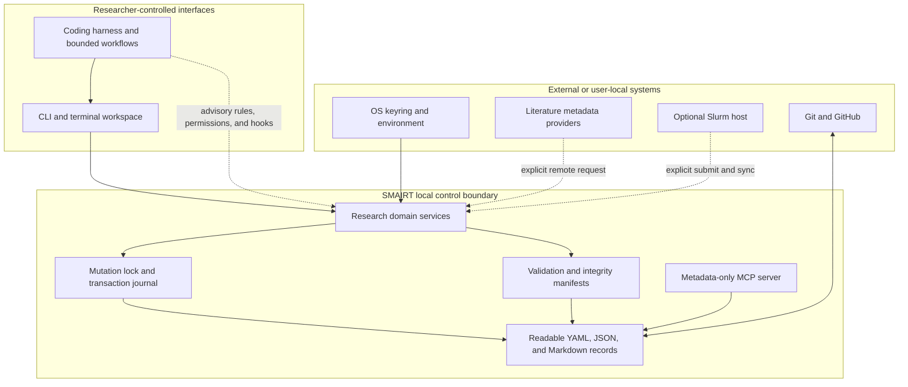

# Architecture

SMAIRT is a Python command-line application with a responsive terminal workspace. Presentation
layers call shared domain modules; coding-harness adapters and agent conversations do not own
scientific state.

## System and trust boundaries

SMAIRT runs with the user's filesystem permissions and is not a sandbox. Harness policies are
defense in depth; domain validation, transactions, integrity checks, and human gates remain
authoritative.

## Runtime modules

- `cli.py` and focused `cli_*.py` modules define commands and output rendering.
- `tui.py` presents the same operations through the terminal workspace.
- `models.py` defines persisted project records; `project.py` validates state and computes status.
- `research.py`, `runner.py`, `science.py`, and `integrity.py` implement research transitions,
  execution, protocol gates, and manifests.
- `references.py`, `literature.py`, `integrations.py`, and `mcp_server.py` implement attributed
  metadata and bounded access.
- `locking.py` and `transactions.py` serialize consequential mutations and support recovery.
- `harnesses.py` and `workflows.py` translate shared boundaries into client-native files.

## State, transactions, and concurrency

`.smairt/locks/mutation.lock` is created atomically and records host, PID, command, contributor, and
acquisition time. Same-process nesting supports composed domain operations. Same-host locks are
auto-recovered only when the PID is conclusively dead; remote or unverifiable ownership requires
explicit confirmation.

Transactions stage content and backups under `.smairt/transactions/<id>/`, record pre/post hashes,
replace targets atomically, and preserve terminal status. An unfinished journal blocks unrelated
mutations until completed or rolled back.

Run reservation happens under the lock. The child process executes without it so independent runs
can overlap. Finalization reacquires the lock and commits status, snapshots, logs, results, and
integrity manifests.

## Extension surfaces

One coding-harness adapter is active per project. Managed-file manifests distinguish framework
content from researcher-owned configuration, and merge-owned JSON preserves unrelated settings.
Six shared workflows cover orientation, literature, design, challenge, interpretation, and paper
work. The [Harness guide](../reference/harnesses.md) documents capability differences.

The MCP process exposes five metadata tools and strips local paths, checksums, PDFs, secrets, and
full text. Optional provider and HPC profiles remain outside tracked project configuration.
