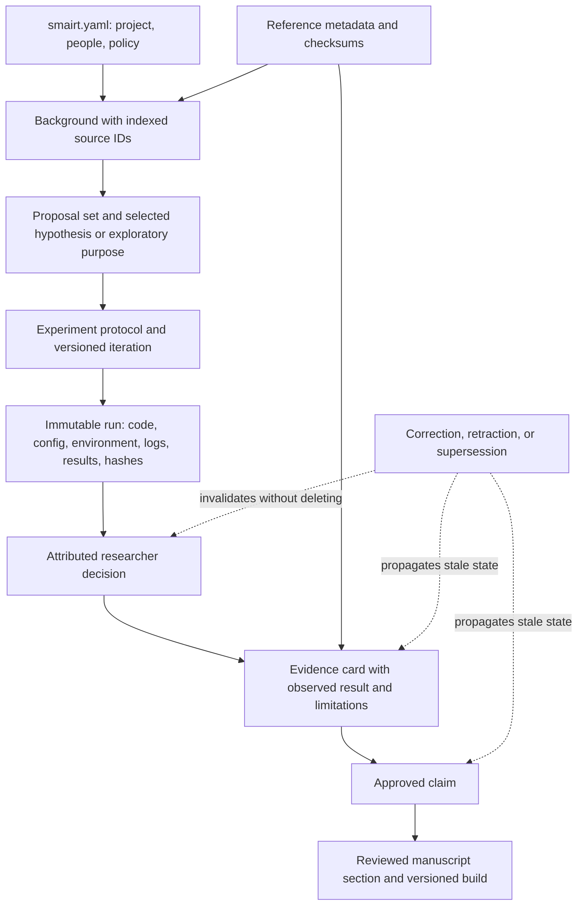

# Scientific workflow and provenance

SMAIRT treats the scientific record as a graph of attributed artifacts and decisions rather than a
folder of final outputs. IDs and hashes link later claims back to the exact sources, methods, runs,
and researcher judgments that support them.

## Durable record flow

## Human gates

The following transitions require an identified contributor and explicit intent:

- selecting or materially revising a hypothesis;
- choosing an experimental route or recording an exploratory purpose;
- deciding whether a run supports further use;
- accepting evidence or approving a claim;
- retracting, superseding, or amending a consequential record;
- changing safety policy or confirming protected sharing.

An assistant may prepare alternatives and review artifacts. It does not inherit authority from the
ability to write files or run commands.

## Evidence states and correction

Verification means that recorded hashes and required files agree with the immutable run manifest.
Acceptance means that a researcher has judged the observed result against declared criteria.
Neither state alone proves generalizability or scientific truth.

Corrections append new records. Retraction invalidates current use; supersession identifies a
reviewed replacement. Earlier artifacts remain available for audit, and dependent evidence or
claims become stale instead of being silently rewritten.

## Context is not the record

`smairt context` and `smairt next --prompt` select bounded files for the current task. Saved context
capsules are disposable and Git-ignored. They help an assistant resume work efficiently, but the
canonical state remains in project records and attributed events.

Model recommendations use portable capability tiers—`cheap`, `balanced`, and `strong`. Concrete
models, provider credentials, and conversation history remain local to the selected harness.
